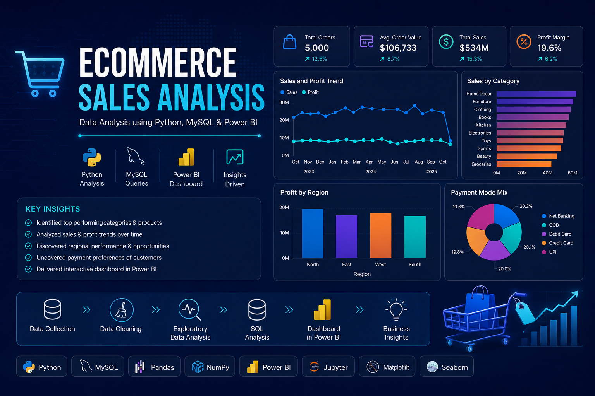

  

# 🛒 Ecommerce Sales Analysis using Python, MySQL & Power BI

A complete end-to-end ecommerce analytics project including data cleaning, SQL analysis, dashboard creation, and business insights.

## 📌 Project Overview

This project analyzes ecommerce sales data using Python, MySQL, and Power BI to uncover business insights and improve decision-making.

The project includes:

- 🧹 Data Cleaning
- 📊 Exploratory Data Analysis (EDA)
- 🗄️ SQL Analysis
- 📈 Dashboard Creation
- 💡 Business Insights
- 📑 Reporting

## 🎯 Problem Statement

Businesses generate thousands of ecommerce transactions every day, making it difficult to identify sales trends, profitable categories, customer purchasing behavior, and regional performance.

The objective of this project is to analyze ecommerce sales data using Python, MySQL, and Power BI to transform raw transaction data into meaningful business insights and interactive dashboards.

## 📊 Dataset Information

- 📦 Total Orders: 5,000
- 🌍 Regions: North, South, East, West
- 🛍️ Categories: Multiple Product Categories
- 💳 Payment Modes:
  - COD
  - Credit Card
  - Debit Card
  - Net Banking
  - UPI

The dataset contains ecommerce transactions from 2023–2025 and is used for business analytics and dashboard development.

## 🛠️ Technologies Used

### Programming

- Python
- MySQL

### Python Libraries

- Pandas
- NumPy
- Matplotlib
- Seaborn

### Visualization

- Power BI

### Tools

- Jupyter Notebook
- Git
- GitHub

## ⭐ Project Features

- 📊 Exploratory Data Analysis (EDA)
- 🧹 Data Cleaning & Preprocessing
- 🗄️ SQL Business Analysis
- 📈 Interactive Power BI Dashboard
- 💰 Sales & Profit Analysis
- 📍 Regional Performance Analysis
- 💳 Payment Mode Analysis
- 📦 Product Performance Analysis
